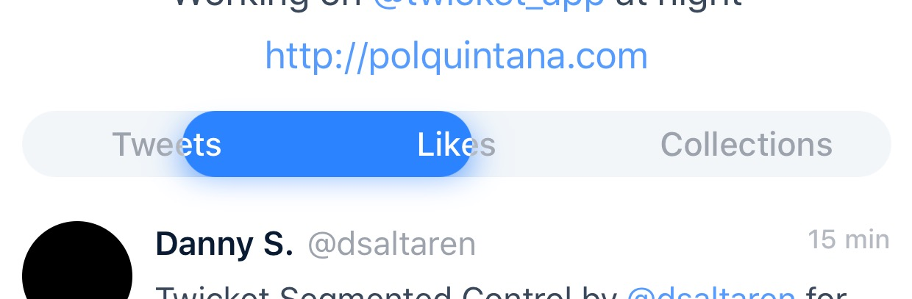

<p align=center></p>

# TwicketSegmentedControl

[](https://github.com/Carthage/Carthage)

<p align=center></p>

<p align=center></p>

Custom UISegmentedControl replacement for iOS, written in Swift, used in the Twicket app.

It handles the inertia of the movement, so you can “throw” the selector from one side to the other.

**Take a look at the design by @dsaltaren on [Dribbble](https://dribbble.com/shots/2976216-Twicket-Segmented-Control)**

###Features:

- Drag and Tap gesture
- Movement animation
- IB compatible
- Customizable colors


###How to use it:
You can either create it using Interface Builder, or by code. 

Whenever the segmented control is instantiated, you'll have to tell it which are going to be the segments it will have:

```swift
	let titles = ["First", "Second", "Third"]
	segmentedControl.setSegmentItems(titles)
```
Every time you use this function, the control is redrawn.

If you want to manually move to an index:

```swift
	segmentedControl.move(to: 2)
```
Keep in mind that the first segment index is `0`

To listen to changes on the selected index you just need to set yourself as delegate:

```swift
	segmentedControl.delegate = self
```

And you'll get notified with the following interface:

```swift
	func didSelect(_ segmentIndex: Int)
```

One last thing to mention, even if you set a different outer frame, its contentView height will always be `40`.


### Customization:

You can customize the segmented control through the following properties:

__defaultTextColor__: UIColor - Text color for unselected segments

__highlightTextColor__: UIColor - Text color for selected segment

__segmentsBackgroundColor__: UIColor - Background color for unselected segments

__sliderBackgroundColor__: UIColor - Background color for selected segment

__isSliderShadowHidden__: Bool - Boolean to decide if the slider should have shadow

###Installation:
####• CocoaPods

```
use_frameworks!

pod 'TwicketSegmentedControl'
```
####• Carthage

```
github "twicketapp/TwicketSegmentedControl"
```
####• Manually

To manually add `TwicketSegmentedControl` to your project you just need to copy the `Source` folder files.
